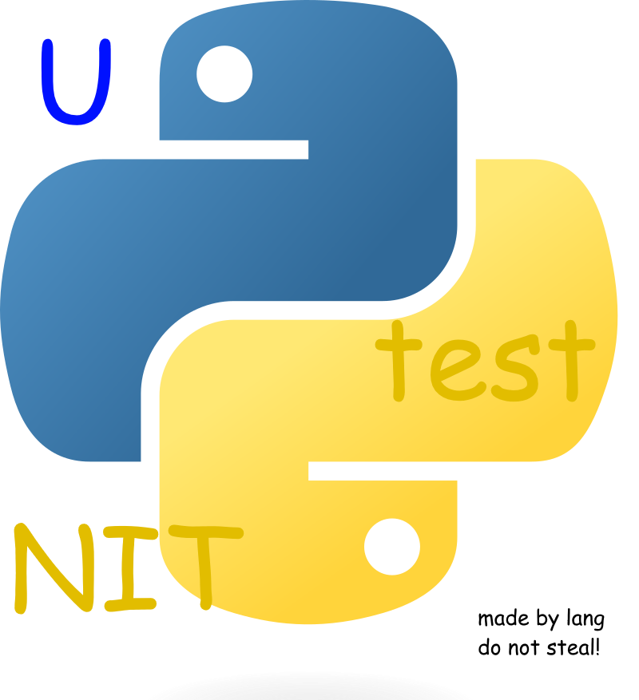
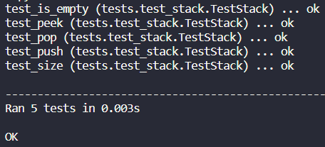

# Seminário Testes Unitários - unittest

<p align="left">
  
</p>



## Criando Ambiente Virtual (venv)

É conveniente criamos um ambiente virtual para executar o projeto. Assim, não precisamos instalar nossas dependências globalmente. Para fazermos isso, execute em um terminal de comando **PowerShell**, por exemplo, os seguintes comandos:

```ps1
python -m venv env
python\Scripts\activate
```

Para executar os comandos em outros terminais de comando, pode haver algumas diferenças de sintaxe. No _prompt_ de comando padrão do Windows, entretanto, estes comandos também funcionam.

## Instalando Dependências

Em **Python**, nossas dependências ficam localizadas em um arquivo `requirements.txt`. Para instalá-las, ainda no mesmo terminal, execute:

```ps1
pip install -r requirements.txt
```

## Execução dos Testes

Desde a versão 2.1 do **Python**, o **unittest** está incluso. Por isso, para executar os testes deste projeto, basta executar os seguintes comandos em um terminal **PowerShell**:

```ps1
python -m venv env
python\Scripts\activate
python -m unittest discover -v
```

## Geração do Relatório

Estamos utilizando uma dependência externa (**xmlrunner**) para criar relatórios de testes. Para gerarmos um relatório, devemos executar:

```ps1
python -m tests
```

Este comando executará o arquivo `__main__.py` dentro do _package_ `tests`. Lá estão as instruções para geração do relatório.
