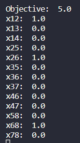
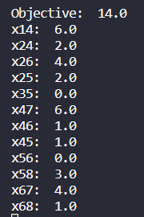

# P108 - L1 - Trabalho - Parte I

## Identificação do Aluno

| Nome                        | Curso                  | Matrícula |
| --------------------------- | ---------------------- | --------- |
| Fabio de Moura Camargo Neto | Engenharia de Software | 22        |

## Atividade 1

### Menor Caminho

O menor caminho que poderá ser utilizado é de 1 para 2, de 2 para 6 e de 6 para 8.

### Distância Total

A distância total do caminho é igual a 5.

### Imagem do Terminal

## Atividade 2

### Capacidade Máxima das Bombas

A capacidade máxima de cada bomba é a seguinte:

| Bomba | Capacidade   |
| ----- | ------------ |
| 1 - 4 | 6 mil litros |
| 2 - 4 | 2 mil litros |
| 2 - 6 | 4 mil litros |
| 2 - 5 | 2 mil litros |
| 3 - 5 | 0            |
| 4 - 7 | 6 mil litros |
| 4 - 6 | 1 mil litros |
| 4 - 5 | 1 mil litros |
| 5 - 6 | 0            |
| 5 - 8 | 3 mil litros |
| 6 - 7 | 4 mil litros |
| 6 - 8 | 1 mil litros |

### Fluxo Máximo

O fluxo máximo na rede é de 14.

### Imagem do Terminal

