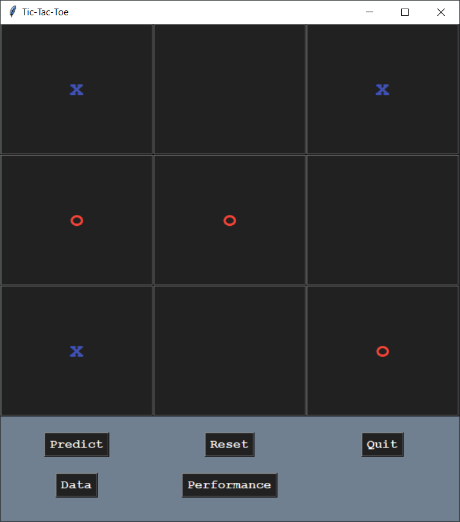

# AG002 - Engenharia de Computação e Software

## 1. Introdução

As instruções para a realização do trabalho podem ser encontradas [aqui](INSTRUCTIONS.md).

## 2. Funcionamento

O trabalho possui uma interface simples, conforme demonstrado abaixo.
Nela, é possível adicionar os valores clicando neles em uma ordem específica, simulando um jogo da velha.



As opções encontradas são: **_Predict_**, **_Reset_**, **_Quit_**, **_Data_** e **_Performance_**.

- **_Predict_:** Realiza uma predição do resultado.
- **_Reset_:** Limpa os valores adicionados.
- **_Quit_:** Fecha a aplicação.
- **_Data_:** Mostra dados do _dataset_.
- **_Performance_:** Mostra performance do modelo de _machine learning_.

Caso haja dúvidas, segue a explicação dos vídeos abaixo:

[](https://youtu.be/WD9g4OF5agY)

## 3. Instalação

Após ter instalado [Python3](https://www.python.org/downloads/), basta executar os seguintes comandos no terminal, após abrir a pasta do projeto:

```cmd
    python -m venv env
    env\Scripts\activate
    pip install --upgrade -r requirements.txt
    python main.py
```
