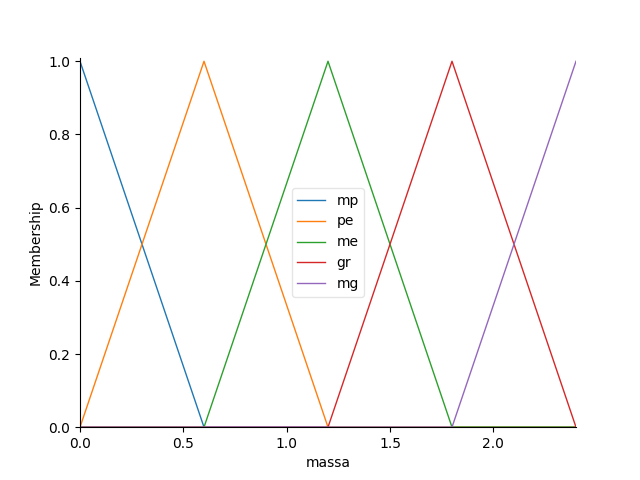
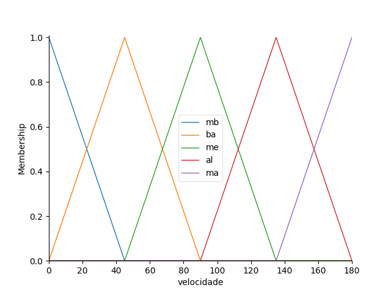
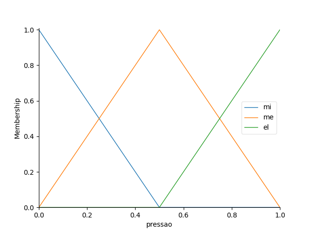
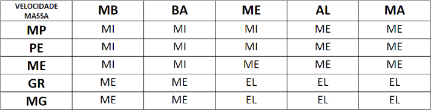

# C210 - Trabalho Prático 02

- Trabalho deverá ser feito em dupla;
- Apenas um aluno deverá submeter o trabalho;
- Envie **APENAS** o arquivo `FuzzyProjeto.ipynb` com a resolução (entregas em outros formatos serão penalizadas);
- Fiquem atentos ao prazo de entrega, pois após o prazo estabelecido não serão aceitas entregas.

## Atividade Sistema Fuzzy

A determinação da pressão em um sistema automatizado para freios automotivos pode ser estimada a partir da quantidade de movimento, ou seja, massa e velocidade, do veículo.

Os especialistas envolvidos com o projeto do sistema especificaram o seguinte sistema fuzzy para ser aplicado neste problema:

#### Variáveis de Entrada

- Velocidade (`km/h`): `0 <= v <= 180`
- Massa do Veículo (`ton`): `0 <= m <= 2.4`

#### Variável de Saída

- Pressão no Freio (`atm`): `0 <= p <= 1`

### Funções de Pertinência

### Regras

#### Velocidade

- MB (muito baixa);
- BA (baixa);
- ME (média);
- AL (alta);
- MA (muito alta).

#### Massa

- MP (muito pequena);
- PE (pequena);
- ME (média);
- GR (grande);
- MG (muito grande).

#### Pressão

- MI (mínima);
- ME (média);
- EL (elevada).

### Validação

Afim de validar o sistema em questão, deseja-se, então,saber qual a pressão a ser exercida nos freios de um veículo com massa de `1,5ton` a uma velocidade instantânea igual a `155km/h`.

**Resposta: `0,55atm`**
